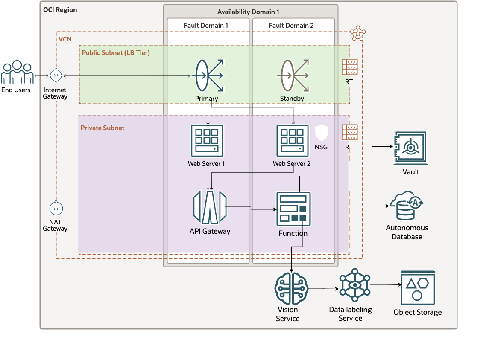

# OCI AI web client

This is a terraform script that will create a web app to consume the OCI vision service, with or without a custom model.

The idea is to have a quick architecture to be able to test custom vision models.

## Architecture

**Components**
- An Autonomous database to save details of the detected objects on the image.
- The vision service and optionally a custom model to be called.
- A python serverless function to call the vision service and the database.
- An API gateway to expose the function.
- Two compute instances as web servers of the app.
- A load balancer on top of the instances to serve the page.



## Requirements

- terraform
- docker

## Configuration

1. Clone this repository (it has a submodule so you need to clone recursive)

```
git clone --recurse-submodules https://github.com/carlgira/oci-tf-vision-web-client.git
```

2. Install the OCI-cli and configure a default profile. You can follow this instructions https://medium.com/@carlgira/install-oci-cli-and-configure-a-default-profile-802cc61abd4f

3. Create an Auth token for your user. (you are going to need it for pushing the function image to OCI registry). https://docs.oracle.com/en-us/iaas/Content/Registry/Tasks/registrygettingauthtoken.htm

4. Create the certificates for the load balancer and the private keys for the compute instances.
```
sh create_self_signed_certificate.sh
```

5. Set the variables in your PATH

- Required variables, tenancy_ocid and the comparment_ocid of the comparment where all the resources are going to be created also the model_id of the custom vision model.
```
export TF_VAR_tenancy_ocid=<>
export TF_VAR_compartment_ocid=<>
export TF_VAR_model_id=<>
```

During the execution of the script it will ask for two more variables, to log into the OCI registry.

- **ocir_user_name:** The full username of your OCI account (<namespace>/username).
- **ocir_user_auth_token:** Auth token created in the previous step.

6. Create dynamic groups.

- Dynamic group to select the API gateway resources in the work comparment

**api-gtw-dg**
```
ALL {resource.type = 'ApiGateway', resource.compartment.id = 'ocid1.compartment.xxx'}
```
- Dynamic group to select the functions resources in the work comparment

**functions-dg**
```
ALL {resource.type = 'fnfunc', resource.compartment.id = 'ocid1.compartment.xxx'}
```

7. Add policies, into the parent comparment.

- Add policies so funtions have access to the vision service and the vault service
```
allow dynamic-group functions-dg to use ai-service-vision-family in compartment <comparment_name>
allow dynamic-group functions-dg to use secret-family in compartment <comparment_name>
```

- Add policy so api gateway can call the function
```
allow dynamic-group api-gtw-dg to use functions-family in compartment <comparment_name>
```

## Functions compilation
I added configuration on the terraform to build and push the function to the OCI registry. Normally is not a best practice to use "local-exec" with terraform, because the execution of the script will depend on the machine you are running (in my case a mac m1). But I wanted to automatize this section as best I could.

You dont need to do this, but if you want to remove the use of the local-exec you'll need to run the next commands.

```
# Login to OCI registry
docker login <ocir_docker_repository> --username <ocir_namespace>/<ocir_user_name>

# Build image on linux
docker build -t ai-vision-func .

# Build image on Mac M1
docker-buildx build --platform linux/amd64 -t ai-vision-func .

# Tag image
docker tag <image> <ocir_docker_repository>/<ocir_namespace>/<ocir_repo_name>/ai-vision-func:0.0.1

# Push image to repository
docker push <ocir_docker_repository>/<ocir_namespace>/<ocir_repo_name>/ai-vision-func:0.0.1
```

## Build
Finally check the plan of terraform and apply it.

```
terraform init
terraform plan
terraform apply
```

## Customize the database
Customize the init_script.sql an create the records of the labels you want the aplication to show.


## Testing

After the script completes it will it will take 1 minute until de load balancer ins active. At the end, terraform will print the load balancer url so you can access the application.

*Remember that the first time the function execute, it needs time to warm up (it could take from 30 seconds to 1 minute), after that all request should go very fast.*


## Destroy
If you want to delete all the resources. 
```
terraform destroy
```

# References

I used several examples on this Github repo https://github.com/cpauliat/my-terraform-oci-examples they are lots of them, great work.


